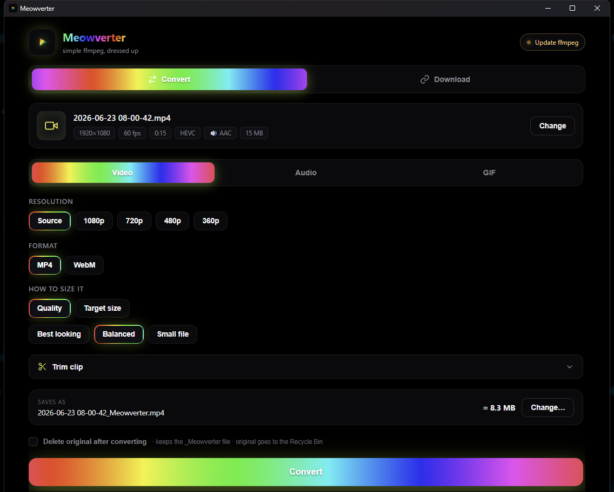

# Meowverter 🏳️‍🌈

Meowverter is my simple all-in-one video converter and downloader for Windows.
I made it because FFmpeg is amazing, but it does not need to feel complicated.

Drop in a video or paste a link and Meowverter figures out what to show you. The
design is pure OLED black with pride RGB colors, smooth animations, and a UI that
actually feels nice to use.

## Download ⬇️

Go to the [latest release](https://github.com/freyavalerie/meowverter/releases/latest),
download the setup `.exe`, and run it. Meowverter is made for 64-bit Windows 10
and Windows 11.

Windows might complain about an unknown publisher the first time. That is only
because I have not bought a Windows code-signing certificate yet. Click "More
info" and then "Run anyway". After installing, Meowverter can update itself from
inside the app.

FFmpeg and the downloader tools set themselves up automatically, so you do not
need to install anything else.

## What it can do ✨

- Convert videos to MP4 H.265, AV1, or WebM
- Pick a quality preset or aim for an exact file size for Discord
- Automatically use the fastest supported NVIDIA, AMD, or Intel encoder
- Fall back to your CPU when the selected format needs it
- Trim to the exact frame with a large live preview
- Rip audio to MP3, M4A, or WAV
- Make GIFs with resolution, FPS, quality, trimming, and a live size estimate
- Download videos from YouTube, TikTok, Facebook, X, Twitch, SoundCloud, and more
- Match Spotify, Apple Music, Deezer, and Tidal songs with a downloadable source
- Queue multiple videos and convert all of them with the same settings
- Optionally move originals to the Recycle Bin after a successful conversion
- Keep converted files easy to spot with the `_Meowverter` name
- Compare the result to the original with a VMAF quality score
- Show progress, download speed, ETA, estimated size, and space saved
- Update Meowverter and FFmpeg from inside the app

That is basically it. Simple when you want it, powerful when you need it.
